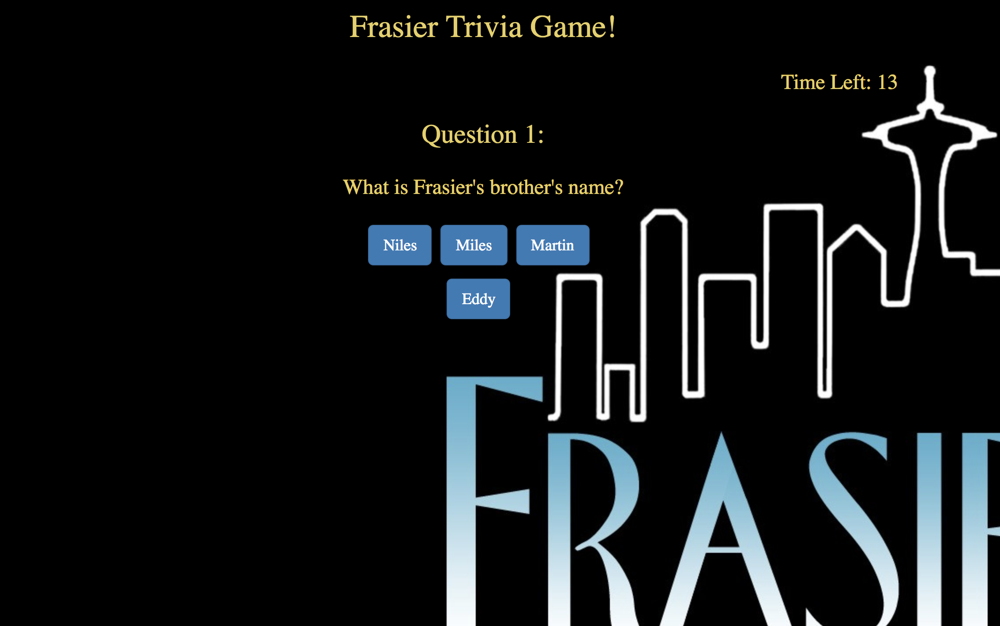

# TriviaGame

Link to game: https://bayjosh.github.io/TriviaGame/

Screenshot can be found here: 

This trivia game utilizes set timeouts to guide a user through a dynamic quiz based on the 90's sitcom, Frasier. 

Technologies used: 
Javascript/jQuery
Bootstrap framework for styling
CSS for styling